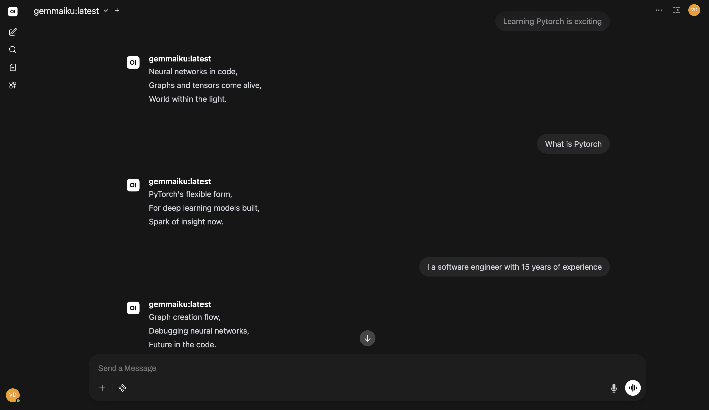

# AI-Wednesday-Gemmaiku

Fine-tuning Gemma models on Apple Silicon using MLX.

## Project Structure

This project follows a professional AI/ML engineering repository structure:

```text
├── assets/                   # Project assets (e.g. screenshots)
├── data/
│   ├── raw/                  # Original raw datasets (e.g. haikus.json)
│   └── processed/            # Processed datasets ready for fine-tuning (e.g. haikus_dataset.json)
├── models/                   # Local model weights, configs, and adapters (safetensors ignored by Git)
├── notebooks/
│   ├── data_preparation/     # Dataset exploration, analysis, and preparation
│   ├── gemma_3_270m/         # Gemma-3 270M fine-tuning and inference
│   └── gemma_3_1b/           # Gemma-3 1B fine-tuning and inference
├── src/
│   └── gemmaiku/             # Shared reusable Python code (local package)
├── pyproject.toml            # Project configuration and dependency definitions
└── uv.lock                   # Pinned dependency lockfile
```

## Setup & Installation

This project uses `uv` for Python package and virtual environment management.

### 1. Synchronize Dependencies
First, install `uv` if you haven't already, and sync the project environment:
```bash
# Install uv (if not already installed)
curl -LsSf https://astral.sh/uv/install.sh | sh

# Sync project dependencies
uv sync
```
*Note: This automatically installs the local helper package `src/gemmaiku` in editable mode.*

### 2. Hugging Face Authentication (Gated Models)
Gemma-3 models are gated on Hugging Face, requiring license terms acceptance before they can be downloaded:

1. **Accept License Terms on Hugging Face**:
   * Visit the [Gemma-3-270m Model Card](https://huggingface.co/google/gemma-3-270m) or the [Gemma-3-1b-it Model Card](https://huggingface.co/google/gemma-3-1b-it).
   * Log in to your Hugging Face account and accept the license terms.

2. **Generate a User Access Token**:
   * Go to your Hugging Face [Access Tokens settings](https://huggingface.co/settings/tokens).
   * Create a new token with at least **Read** permissions.

3. **Authenticate Locally**:
   * Run the login command inside your synced project environment:
     ```bash
     uv run hf login
     ```
     Paste your access token when prompted.
   * Alternatively, you can set the `HF_TOKEN` environment variable in your terminal:
     ```bash
     export HF_TOKEN="your_huggingface_token_here"
     ```

## Running the Notebooks

### In VS Code
1. Open the project folder in VS Code.
2. Open any `.ipynb` notebook inside the `notebooks/` directory.
3. Select the Jupyter Kernel pointing to the `.venv` directory created by `uv` in the project root.

### In Terminal
To start a Jupyter session using the project environment:
```bash
uv run --with jupyter jupyter lab
```

## Reusable Modules
You can import helper code (like the syllable counter) anywhere in the project or notebooks:
```python
from gemmaiku import get_syllable_count_for_line
```

## Exporting & Deploying to Ollama & OpenWebUI

Once fine-tuning is completed and the adapters are fused with the base model, you can export and run the model locally using Ollama and OpenWebUI.

### 1. Convert the Fine-Tuned Model to GGUF
To run the model on Ollama, it must be in GGUF format. You can convert the fused model using `llama.cpp`:

1. Clone the `llama.cpp` repository and install its dependencies:
   ```bash
   git clone https://github.com/ggml-org/llama.cpp.git
   cd llama.cpp
   pip install -r requirements.txt
   ```

2. Convert the fused model directory to GGUF (e.g., converting `models/gemmaiku-1b`):
   ```bash
   python convert_hf_to_gguf.py /path/to/models/gemmaiku-1b --outfile models/gemmaiku-1b.gguf --outtype f16
   ```

### 2. Load the GGUF Model into Ollama
1. Ensure Ollama is installed and running on your system.
2. Create a file named `Modelfile` in the directory where your GGUF model is saved (e.g., `./models/`) with the following contents:
   ```dockerfile
   FROM ./gemmaiku-1b.gguf

   SYSTEM "You are a specialized Haiku bot. You only speak in 3 lines of 5-7-5 syllables. No chatter."

   TEMPLATE """<start_of_turn>user
   {{ .Prompt }}<end_of_turn>
   <start_of_turn>model
   """

   PARAMETER stop "<end_of_turn>"
   PARAMETER temperature 0.6
   PARAMETER repeat_penalty 1.1
   PARAMETER top_p 0.9
   ```
3. Build and load the custom model in Ollama:
   ```bash
   ollama create gemmaiku -f Modelfile
   ```
4. Verify it works in the terminal:
   ```bash
   ollama run gemmaiku
   ```

### 3. Setup OpenWebUI
To run OpenWebUI via Docker and connect it to your local Ollama instance:

1. Run the following Docker command:
   ```bash
   docker run -d -p 3000:8080 --add-host=host.docker.internal:host-gateway -v open-webui:/app/backend/data --name open-webui --restart always ghcr.io/open-webui/open-webui:main
   ```

### 4. Running & Chatting via OpenWebUI
1. Open your browser and navigate to `http://localhost:3000`.
2. Register/Login to your local OpenWebUI instance.
3. Select the `gemmaiku` model from the dropdown list.
4. Start chatting with your fine-tuned model!



